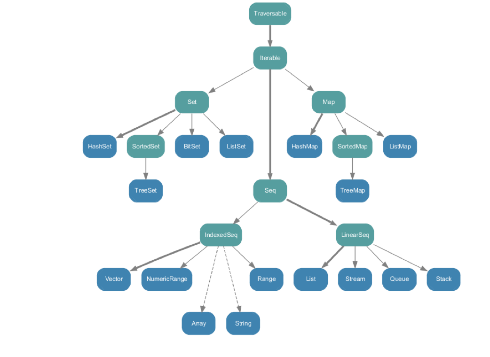

# SCALA KURS #
### Jon-Anders Teigen
### [Arktekk](http://arktekk.no)
### [@jteigen](http://github.com/jteigen)

---

<h2><font color="red"> ♥</font> MASSE programmering <font color="red"> ♥</font></h2>
<h2><font color="red"> ♥</font> MASSE teori <font color="red"> ♥</font></h2>

---

## Pauser når dere føler for det!

---

## Kloke hoder tenker best sammen ##
* Jobb i par
* Diskuter i par/felleskap
* Spør om hjelp om dere sitter fast

---

## Men først ... ##
* Hvem er du ?
* Hva har du lyst til å lære ?

---

## *Ladies and gentlemen, start your engines..* ##
* [IntelliJ](http://www.jetbrains.com/idea/) / [Eclipse](http://scala-ide.org/)
* [SBT](https://github.com/harrah/xsbt/wiki/Getting-Started-Setup)
* [Git](http://help.github.com/win-set-up-git/)
* [https://github.com/arktekk/scala-kurs-oppgaver](https://github.com/arktekk/scala-kurs-oppgaver)

---

```scala
"hello"             // string
true false          // boolean
5                   // int
5.5                 // double
5f                  // float
1e30f               // float exponential
1.0e-100            // exponential double
0xA                 // 10 hex int
012                 // 10 octal int
1000L               // long
'a'                 // character
'\u0041'            // unicode character
"""a multi
line "string"
"""                 // multiline escaped string
<hello/>            // xml
'alright            // symbol
```

---

## variabler ##
```scala	
var foo = 5
foo = 6

// eksplisitt typet
var foo:Int = 5
```

---

## values ##
```scala
val x = "Hello"

// eksplisitt typet
val x:String = "Hello"
```

---

## metode ##
```scala
def foo:Int = {
  return 5
}
```

---

## metode ##
```scala
def foo:Int = {
  5
}

// siste expression returneres alltid
```

---

## metode ##
```scala
def foo = {
  5
}

// return type inference
```

---

## metode ##
```scala
def foo = 5

// single expression
```

---

## void/Unit metoder ##
```scala
def something(i:Int):Unit = {
  println("Do " + i)
}
```

---

## void/Unit metoder ##
```scala
def something(i:Int) {
  println("Do " + i)
}

// return type inference og ingen =
```

---

## void/Unit uten parameter ##
```scala
def printSomething(){
  println("something")
}

// () indikerer sideeffekt
```

---

## nøstet definisjon ##
```scala
val nesting = {
  def plus(a:Int, b:Int) = a + b
  val x = {
    val y = 5 - 3
    y - 2	
  }
  val z = plus(x, 10)
  z / 2
}
```

---

## lazy ##
```scala
lazy val person = {
  println("fra DB")
  DB.findPersonByPk(5)
}
println("etter")
person.name

// etter
// fra DB
```

---

## equality ##
```scala
val a = new String("Hello")
val b = new String("Hello")

a == b // true (java equals)
a eq b // false (java ==)
```

---

## string interpolation

```scala
val msg = "World"

s"Hello ${msg}"
```

---

## Java ##
```java
class Person {
  private final String name;
  private Integer age;

  public Person(String name, Integer age){
    this.name = name;
    this.age = age;
  }

  public String getName(){
    return name;
  }

  public Integer getAge(){
    return age;
  }

  public void setAge(Integer age){
    this.age = age;
  }

  public static Person create30(String name){
    return new Person(name, 30);
  }

  @Override
  public String toString(){
    return "["+name+","+age+"]";
  }
}
```

---

## object / class ##
```scala
object Person {
  def create30(name:String) = new Person(name, 30)
}

class Person(val name: String, var age: Int){
  override def toString = s"[$name,$age]"
}

```

---

## unified access ##
```scala
class Person(private val _name: String,
             private var _age: Int) {

  def name = _name	

  def age = _age	

  def age_=(a:Int){
    _age = a	
  }
}
```

---

## unified access ##
```scala
val person = Person.create30("foo")

person.name // foo

person.age = 29
person.age // 29
```

---

## Tupler ##
```scala
val ab = (5, "Hello")
val ab = 5 -> "Hello"

val abc = (5.5, "World", List(1, 2, 3))

ab._1 // 5
ab._2 // "Hello"

abc._3 // List(1, 2, 3)
```

---

## collections ##


---

## collection "literals" ##

```scala
val list   = List(1, 2, 3)
val map    = Map(1 -> "a", 2 -> "3")
val set    = Set("a", "b", "c")
val vector = Vector("a", "b", "c")
val array  = Array(1, 2, 3)
val range  = 1 to 10
```

---

## mutable ##


---

## immutable



---

```scala
val list = List(1, 2, 3)
val cons = 1 :: 2 :: 3 :: Nil

val map = Map(1 -> "Hello")
val helloWorld = map + (2 -> "World")
val world = helloWorld - 1

val vector = Vector(1, 2)
val appended = vector :+ 3
val prepended = 1 +: appended
```

---

## imperative vs functional 

```scala
case class Person(name:String, age:Int)

val people = List(Person("kid-a", 10),
                  Person("kid-b", 12),
                  Person("mom", 42),
                  Person("dad", 43))
```

---

```scala
var ages = new ListBuffer[Int]

for(person <- people){
  ages += person.age
}

val ages = people.map(person => person.age)

// List(10, 12, 42, 43)
```

---

```scala
var kids = new ListBuffer[Person]

for(person <- people){
  if(person.age < 18)
    kids += person
}

val kids = people.filter(person => person.age < 18)

// List(Person("kid-a", 10), Person("kid-b", 12))
```

---

```scala
case class Owner(pets:List[String])
val owners = List(Owner(List("Dog", "Cat")),
                  Owner(List("Fish")))

var pets = new ListBuffer[String]

for(owner <- owners){
  pets ++= owner.pets
}

val pets = owners.flatMap(owner => owner.pets)

// List("Dog", "Cat", "Fish")
```

---

```scala
var kids   = new ListBuffer[Person]
var adults = new ListBuffer[Person]

for(person <- people){
  if(person.age < 18)
    kids += person
  else
    adults += person
}

val (kids, adults) = people.partition(person => person.age < 18)

val (kids, adults) = people.partition(_.age < 18)
```

---

## mer snacks

```scala
val first10 = list.take(10)

val dropped = list.drop(5)

case class Person(fornavn:String, etternavn:String)

val personer:List[Person] = ...

val familier:Map[String, List[Person]] =
  personer.groupBy(_.etternavn)

val fornavn:Map[String, List[String]] = 
  familier.mapValues(personer => personer.map(_.fornavn))

val sortert:Seq[(String, List[String])] =
  fornavn.toSeq.sortBy(_._1.size)
```

---

## collections er funksjoner

```scala
val list = List(1,2,3)
list(0) // of its indexes

val map = Map("A" -> 1, "B" -> 2)
map("A") // of its keys

val set = Set(1,2,3)
set(1) // contains
```

---

## Null<font color="red"> ♥</font> ? ##
```scala
import java.util.HashMap
val map = new HashMap[Int, String]
map.put(0, null)
...
map.get(0) // null
map.get(1) // null

if(map.containsKey(0)){
  return map.get(0)
}
```

---

## option
```scala
val map = Map(1 -> "Hello", 2 -> "World")
map.get(1) // Some("Hello")
map.get(0) // None

map(1) // "Hello"
map(0) // java.util.NoSuchElementException
```

---

```scala
trait Option[+A] {
  def get:A // eller java.util.NoSuchElementException
  def getOrElse(a:A):A
  def map(f:A => B):Option[B]
  def flatMap(f:A => Option[B]):Option[B]
}

object None extends Option[Nothing]
case class Some[A](value:A) extends Option[A]
```

---

## NullPointerException <font color="red"> ♥</font> ? ##
```java
class Stuff {
  /* can be null */	
  public String getIt(){ ... }
}
```
```scala
val stuff:Option[String] = Option(stuff.getIt)
```

---

## oppgavetid ##
[https://github.com/arktekk/scala-kurs-oppgaver/tree/master/buzzword](https://github.com/arktekk/scala-kurs-oppgaver/tree/master/buzzword)

