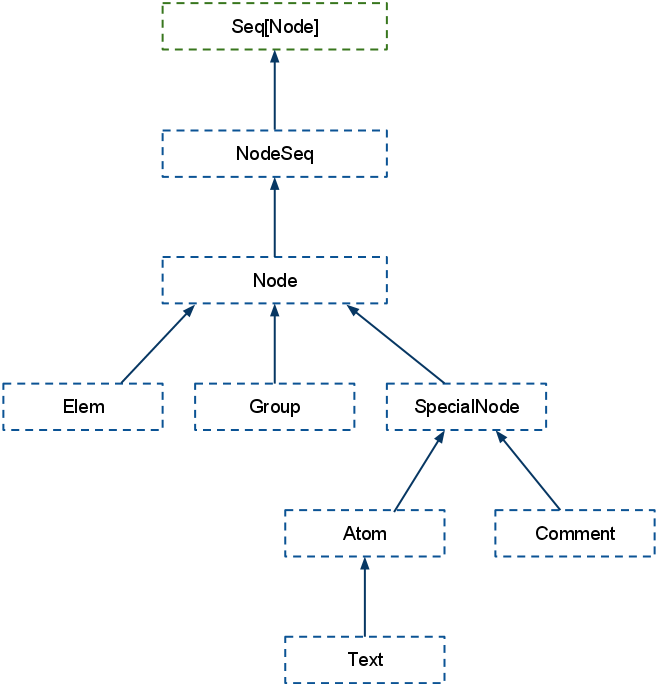

# XML #
* `<literal xml="support"/>`
* kan navigeres som en collection (for-comprehensions)
* korrekt escaping
* ganske immutable (men ikke helt)
* snodig arvehierarki

---

```xml
<?xml version="1.0" encoding="utf-8"?>
<weatherdata>
  <forecast>
    <text>
      <location>
        <time from="2011-12-23" to="2011-12-24" type="obsforecast">
          <title>Friday and Saturday</title>
          <body>&lt;strong&gt;Telemark:&lt;/strong&gt; Våte veibaner og synkende 
          temperatur kan stedvis gi glattere veier fra natt til julaften.</body>
        </time>
        <time from="2011-12-24" to="2011-12-25">
          <title>Saturday and Sunday</title>
          <body>&lt;strong&gt;Østlandet og Telemark:&lt;/strong&gt; Vestlig bris. Stort sett
          pent vær. I kveld sørvestlig bris, økende til liten og periodevis stiv kuling 15 m/s på	
          kysten. Skyet eller delvis skyet. Oppholdsvær, men lengst vest regn, snø i høyden. Søndag
          kveld sørvestlig frisk bris 10, sterk kuling 20 på kysten. Spredt regn, snø i høyden. Nedbør
          vesentlig i vestlige områder.</body>
        </time>
        ...
```

---

```scala
case class Time(from:String, to:String, title:String, body:String)

val xml = XML.load(getClass.getResourceAsStream("forecast_hour_by_hour.xml"))

val forecasts = for {
  forecast <- xml      \  "forecast"
  text     =  forecast \  "text" // child select
  time     <- text     \\ "time" // deep select
  from     =  time     \ "@from" // attribute select
  to       =  time     \ "@to"
  title    =  time     \ "title"
  body     =  time     \ "body"
} yield Time(from.text, to.text, title.text, body.text)
```

---

```scala
<weatherdata>
  <forecast>
    <text>
      <location>{ forecasts.flatMap{ case Time(from, to, title, body) =>
        <time from={from} to={to}>
          <title>{title}</title>
          <body>{body}</body>
        </time> }}
      </location>
    </text>
  </forecast>
</weatherdata>
```

---

```scala
val obs = for {
  time  <- xml \\ "time"
  tpe   = time \ "@type" if tpe.text == "obsforecast"
  body  = time \ "body"
  title = time \ "title"
} yield title.text -> body.text

// (Friday and Saturday,<strong>Telemark:</strong> Våte veibaner og 
//    synkende temperatur kan stedvis gi glattere veier fra natt til julaften.)
```

---

